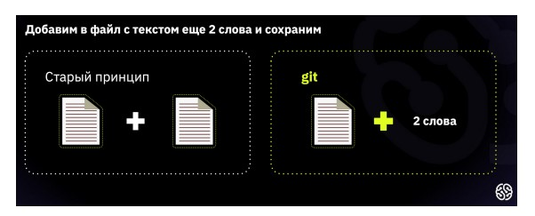

# Инструкцию по работе с Git с использованием возможностей Markdown #

## Что такое Git? ##

Git — система контроля версий (файлов). Сохраняет только внесенные изменения, без дублирования файлов. Сохраняет исходный документ и изменения.

На рисунке ниже приведено [отличие между хранением данных в системе Git и обычным хранением: 

## Особенности языка Markdown ##

> Markdown — это облегченный язык разметки с синтаксисом форматирования обычного текста, расширение .md

Для описания работы в системе по контролю версий Git использованы следующие кодировки языка Markdown:

* чтобы сделать текст *курсивным*, надо поставить по одной звёздочки (или по одному знаку нижнего подчеркивания) слева и справа от слова (текста), который нужно выделить;

* чтобы сделать текст **полужирным**, надо поставить по две звёздочки (или по два знака нижнего подчеркивания) слева и справа от слова (текста), который нужно выделить;

Альтернативные способы выделения текста _курсивом или **полужирным**_ нужны для того, чтобы мы могли совмещать оба этих способа.

* чтобы добавить списки, надо поставить:

  * звёздочку (или знак плюс) и пробел перед началом строки (если это НЕнумерованный список)
  
  + цифру и пробел перед началом строки (если это нумерованный список);

* чтобы вставить заголовок, надо поставить решетку и пробел перед началом элемента строки. Показать уровень заголовка — подчеркивание знаками = или ****

* чтобы вставить картинку, надо поставить восклицательный знак, затем без пробела квадратные скобки, в которых необходимо указать краткое название рисунка, затем без пробела в круглых скобках указать путь к файлу c картинкой.

>Предварительно необходимый файл нужно вложить в отслеживаемую папку.

* чтобы вставить ссылку, надо поставить квадратные скобки, в которых необходимо кратко описать содержимое ссылки, затем без пробела в круглых скобках указать саму ссылку.

Подробно с синтаксисом данного языка можно ознакомиться на сайте Майкософт в [Справочнике по Docs Markdown](https://docs.microsoft.com/ru-ru/contribute/markdown-reference).

## Команды Git (пишутся через пробел) ##
1. **git init** позволяет сделать из нашей папки репозиторий

>Репозиторий - это папка, в которой настроена система контроля версий. Это надо выполнить в той папке, из которой хотите сделать репозиторий. То есть сначала переходите в нужную папку.

2. **git add** и имя файла позволяет добавить файл к отслеживанию в этой программе

>Обязательно добавляем расширение!

3. **git commit** позволяет сохранить текущее состояние, добавляя **–m,** указываем комментарий, который напомнит, что в этом файле происходит

4. **git diff** позволяет посмотреть, чем отличается наш текущий файл от того, что уже сохранено

5. **git log** позволяет посмотреть журнал всех изменений

6. **git status** позволяет посмотреть текущий статус

7. **git --version** позволяет проверить текущую установленную версию программы
8. **git checkout** и первые четыре символа из названия версии файла, чтобы перейти к той версии файла, которая нас интересует.

>Однако, чтобы дальше работать с этим файлом, нам требуется вернуться в актуальное состояние.

9. **git checkout master** позволяет вернуться в актуальное состояние

10. **clear** очищает поле терминала от ранее введённых команд
11. **git branch** и имя новой ветки позволяет создать новый черновик, изменения в котором не будут отражаться в чистовике (master)
12. **git branch** позволяет вывести на экран список имеющихся у нас веток
>Ветка, на которой мы располагаемся, отмечена звёздочкой.
13. **git checkout** и имя новой ветки позволяет перейти на выбранную ветку.
14. **git merge** и имя ветки, которую необходимо добавить, позволяет добавить изменения из выбранной ветки в текущую ветку
>Происходит слияние данных из двух разных веток.
15. **git branch –d** и имя ветки, которую необходимо удалить, позволяет удалить выбранную ветку
>Находится в данный момент следует на другой ветке.
16. **git log –graph** позволяет видеть историю изменений в виде красивого графа/дерева
17.	**git clone** и адрес удаленного репозитория, находящийся на сервисе GitHub, позволяет скопировать указанный репозиторий в наш локальный.
18.	**cd** и имя новой папки, скопированной с удаленного репозитория (с сервиса GitHub), позволяет Git начал отслеживать все изменения в выбранной папке.
19.	**git remote add** и адрес удалённого репозитория, позволяет связать наш локальный репозиторий с удалённым репозиторием.
20.	**git branch –M** и имя ветки, которая будет основной, позволяет выделить основную ветку.
21.	**git push – u**, название удалённого репозитория и имя ветки позволяет отправить («протолкнуть») всё, что мы сделали у себя локально, куда-то на удалённой репозиторий, в интернет.
22.	**git push** позволяет отправить то, что есть на нашем репозитории, на удалённый репозиторий.
23.	**git pull** позволяет скачать всё актуальное из нашего удалённого репозитория.

## Практическое задание ##
 Выполним несколько задач для более понятного владения системой Git.

### Проверяем текущую установленную версию программы ###
  * Вводим команду **git --version**, чтобы проверим текущую установленную версию программы.

### Создаём новый файл ###
1. Создадим папку, например, git_education, чтобы отслеживать изменения, надо где-то наши файлы хранить.
2. Запустим русифицированную программу Visual Studio Code.
3. Открываем созданную папку в программе Visual Studio Code (в левом верхнем углу есть проводник, кликаем по нему и открываем созданную на рабочем столе папку).
4. Запускаем терминал (пункт «Вид» и в выпадающем окошке выберем «Терминал»).
> Терминал — это окошко, где указана ваша учётная запись, имя компьютера, на котором работаете, и поле для ввода команд.
5. Вводим в терминале команду **git init**, чтобы в нашей папке Git начал отслеживать все изменения.
Если откроете скрытые файлы, заметите, что в папке git_education появилась скрытая папка .git.
6. Создадим новый файл в папке git_education с расширением .md (язык разметки Markdown).
7. Сохраним этот файл, нажав Ctrl+s или Cmd+s
8.	Вводим команду **git status**, чтобы Git указал текущий статус (в данном случае, что есть не отслеживаемые файлы).
> Чтобы снова вызвать команду, которую уже писали, можно воспользоваться стрелками на клавиатуре. Если нажать стрелочку «вверх», будут открываться те команды, которые создавались до этого. Вы можете переключаться между
ними.
9.	Вводим команду **git add** и укажем файл, который надо добавить, чтобы Git начал отслеживать изменения в этом файле.
> Если ввести первые две буквы файла и нажать Tab, терминал самостоятельно заполнит то, что надо написать. Обязательно добавляем расширение.
10.	Вводим команду **git status**, чтобы Git указал текущий статус.
11.	Вводим команду **git commit –m** и в кавычках указываем комментарии о том, какие изменения внесены (принято писать на английском языке), чтобы в дальнейшем понять, какое было сделано сохранение и для чего.

### Изменяем файл ###
12.	Изменим файл (например, добавим текст)
13.	Сохраним изменения, нажав Ctrl+s или Cmd+s
14.	Вводим команду **git add** и укажем файл, который надо добавить, чтобы Git начал отслеживать изменения в этом файле.
15.	Вводим команду **git commit –m** и в кавычках указываем комментарии о том, какие изменения внесены (принято писать на английском языке), чтобы в дальнейшем понять, какое было сделано сохранение и для чего.

### Создаём журнал изменений ###
16.	Вводим команду **git log**, чтобы посмотреть версии файлов, которые мы сохранили.
> Log — это просто журнал изменений, каких-то событий, которые у нас
хранятся.
17.	Вводим команду **git checkout** и первые четыре символа из названия версии файла, чтобы перейти к той версии файла, которая нас интересует.
> Однако, чтобы дальше работать с этим файлом, нам требуется вернуться в актуальное состояние.

### Возвращаемся в актуальное состояние ###
18.	Вводим команду **git checkout master**, чтобы вернуться в актуальное состояние.
>Master — это название ветки, в которой работаем.

>Git должен понимать, что мы начинаем что-то менять с той версии, которая была.

>Отобразить файл в программе VS Code в том виде, который видит конечный пользователь, можно с помощью специальной кнопки. Слева располагается то, что пишем мы, а справа — вид для конечного пользователя.

### Возврат к предыдущим сохранениям ###
19.	Вводим команду **git log**, чтобы посмотреть версии файлов, которые мы сохранили.
20.	Вводим команду **git checkout** и первые четыре символа из названия версии файла, чтобы перейти к той версии файла, которая нас интересует.
> Обратите внимание, что если файл переименовался (если файл был переименован), текущий файл (с новым названием) удалён. Если открыть файл с исходным состоянием, мы увидим файл уже с неправильным названием.

### Просмотр разницы между текущим файлом и сохранённым ###
21.	Вводим команду **git diff**, чтобы посмотреть разницу между текущим состоянием файла и тем, что уже сохранено.
> Обратите внимание, Git сравнивает записанные версии файлов. Если что-то меняете, но изменения не записали, для Git файл не изменится.

 Создадим новую ветку ###
22. Вводим команду **git branch** и указываем имя новой ветки (например, text_formatting), чтобы создать новый черновик, изменения в котором не будут отражаться в чистовике (master).
23. Вводим команду **git branch**, чтобы вывести на экран список имеющихся у нас веток.
Ветка, на которой мы располагаемся (в данном случае master), отмечена звёздочкой.
24. Вводим команду **git checkout** и указываем имя новой ветки (в данном случае text_formatting), чтобы перейти на выбранную ветку.
25. Вводим команду **git branch**, чтобы вывести на экран список имеющихся у нас веток.
>Ветка, на которой мы СЕЙЧАС располагаемся (в данном случае text_formatting), отмечена звёздочкой.
26. Изменим файл (например, добавим текст)
27. Сохраним изменения, нажав Ctrl+s или Cmd+s
28. Вводим команду **git add** и укажем точку, чтобы Git начал отслеживать изменения во всех файлах, находящихся в выбранной папке.
29. Вводим команду **git commit –m** и в кавычках указываем комментарии о том, какие изменения внесены (принято писать на английском языке), чтобы в дальнейшем понять, какое было сделано сохранение и для чего.
### Совместим ветви ###
30. Вводим команду **git checkout** и указываем имя чистовика (master), чтобы перейти на эту ветку.
31. Вводим **git merge** и укажем ветку, которую необходимо добавить (в данном случае text_formatting).
>Видим, что в ветке master обновился файл, подтянулась информация, из ветки text_formatting.
32. Вводим команду **git log**, чтобы посмотреть версии файлов, которые мы сохранили.
> В log мы видим все совершенные изменения, вплоть до добавления изменений после слияния веток.

>Важно! После объединения ветвей text_formatting и master мы получаем одну общую, не отдельную, ветвь master, в которой все коммиты расположены в одном порядке.
### Удалим ветви ###
33. Вводим **git branch –d** и укажем ветку, которую необходимо удалить (в данном случае text_formatting).
### Уберем файл из отслеживания ###
34. Добавим файл с названием .gitignore и внутри файла укажем имя файлов, которые необходимо игнорировать Git.
>Важно! Не допустить ошибки в названии файла. 
### Объединим ветви с разной информацией ###
>Когда один и тот же текст в разных ветках написан по-разному. Если будем сливать эти ветки, возникнет конфликт, Git не поймёт, какую версию необходимо использовать.
35. Вводим **git merge** и укажем ветку, которую необходимо добавить (допустим ранее введенную ветку Lists).
>Видим, что в ветке master обновился файл, подтянулась информация, из ветки Lists, но с конфликтом.

>При проверке (git log) в блоке со списками есть 2 варианта. В одном из них указано HEAD. Это то, где мы находимся. И есть вариант, который пришёл из lists. Git не может самостоятельно решить, какую же версию ему использовать.

>У Visual Studio Code есть возможность принять текущую версию, которая к нам пришла. Текущая версия — это Current Change (с англ. текущие изменения). Incoming change (с англ. входящие изменения) это то, что пришло с другой ветки. Есть возможность оставить и сравнить оба варианта. Затем внеси нужные изменения и сохранить их.
### Визуализируем все имеющиеся коммиты ###
36. Вводим **git log –graph**, чтобы видеть историю изменений в виде красивого графа/дерева.

## Практика. Работа с сайтом github.com ##

На рисунке ниже приведены отличия между cистемой Git и сервисом GitHub

### Возьмём готовый репозиторий с сайта github.com	
1.	Перейдем на сайт github.com
2.	Вводим в строку поиска (вверху слева) одного из готовых репозиториев.

> При переходе в указанный репозиторий мы видим файлы.
3.	Нажимаем на зеленую кнопку Code, чтобы посмотреть строку с адресом выбранного файла.
4.	Скопируем указанный адрес.
5.	Откроем VS Code.
6.	Вводим команду **git clone** и укажем тот адрес, который скопировали, чтобы скопировать репозиторий, находящийся на сервисе GitHub, в наш локальный репозиторий.

>При этом имя новой папки, которая появилась, будет совпадать с именем скопированного репозитория на GitHub.
7.	Вводим команду **cd** и укажем имя новой папки, которая скопировалась с удаленного репозитория (с сервиса GitHub), чтобы Git начал отслеживать все изменения в выбранной папке.
8.	Вводим команду **git log**, чтобы посмотреть версии файлов, которые были сохранили ранее (не нами, а удаленным пользователем).
### Выгрузим локальный репозиторий на сайт github.com
1.	Откроем (или создадим) папку для отслеживания.
  * Создадим в ней новый репозиторий:

>Для этого вводим в терминале команду git init, чтобы в нашей папке Git начал отслеживать все изменения.

>Если откроете скрытые файлы, заметите, что в папке появилась скрытая папка .git.
  * Создадим новый файл в папке.

  * Сохраним этот файл, нажав Ctrl+s или Cmd+s

2.	Заходим на сайт github.com.
3.	Нажимаем «+» в правом верхнем углу, выбираем «New repository» (новый репозиторий), даем ему имя.
4.	Нажимаем кнопку Create repository, чтобы создать repository.
GitHub предлагает советы, что можно сделать, чтобы начать работать с этим репозиторием:
    +	Можно создать новый репозиторий через терминал и начать с этим работать.
    +	Уже существующий репозиторий привязать к удалённому репозиторию.
    +	Импортировать код из другого репозитория.
5.	Вводим **git remote add origin** и укажем ссылку с адресом на удалённый репозиторий, с которой надо будет работать, чтобы связать наш локальный репозиторий с удалённым репозиторием.

>Т.к. у нас уже есть репозиторий, который работает локально, и сейчас мы хотим эту информацию отправить на GitHub, чтобы она появилась в интернете. Для этого используем список команд совета «Уже существующий репозиторий привязать к удалённому репозиторию».
6.	Вводим команду **git branch –M** и указываем имя ветки, которая будет основной.
7.	Вводим команду **git push – u** и указываем название удалённого репозитория и имя ветки, чтобы отправить («протолкнуть») всё, что мы сделали у себя локально, куда-то на удалённой репозиторий, в интернет.
8.	Пройдем авторизацию.

>Это необходимо, чтобы GitHub убедился, что мы действительно имеем право на внесение туда изменений.
### Внесем изменения на удаленный репозиторий на сайте github.com
1.	Изменим файл на сайте github.com.
2.	Сохраним изменения, добавив коммит и нажав кнопку Commit changes.
### Синхронизируем локальный и удаленный репозиторий с сайта github.com
1.	Вводим команду **git pull**, чтобы скачать всё актуальное из нашего удалённого репозитория.
merge прошёл успешно, никаких конфликтов не возникло
### Внесем с помощью запроса изменения на удаленный репозиторий на сайте github.com
>Возьмём готовый репозиторий с аккаунта, к которому у нас нет доступа.
1.	Перейдем на сайт github.com
2.	Вводим в строку поиска (вверху слева) одного из готовых репозиториев.
3.	При переходе в указанный репозиторий мы видим файлы.
4.	Нажимаем на кнопку Fork, чтобы сделать полную копию этого репозитория на своём аккаунте.
5.	Возьмём готовый репозиторий с сайта github.com, используя команду **git clone**.
6.	Добавим изменения.

>Когда мы хотим внести или предложить изменения в чей-то проект, это всегда делается в отдельной ветке.
7.	Выгрузим локальный репозиторий на сайт github.com, используя команду git push.

>На сайте github.com после обновления увидим новую ветку, которую мы создали.

8.	Нажимаем кнопку Compare & pull request, добавив комментарии, чтобы отправь запрос на вливание того, что сделано, в основной репозиторий, к которому у нас нет доступа.

>Затем в аккаунте хозяина основного репозитория появляется новое поле. Он посмотрит на изменения, которые мы сделали, если произведённые изменения его устроят, он может влить эту ветку в основной репозиторий.

## LearnGitBranching ##
Cайт LearnGitBranching - интерактивный тренажёр, книга и инструмент для обучения системы Git.